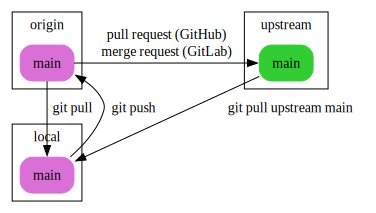

# git beginner cheat sheet

This is an introductory **git cheat sheet** targeting **beginner-level git users**. With the commands shown here, **you will be able to start tracking the history of your projects**. There is certainly a lot more you can do with git (and a lot cleaner), but the important thing is to **get you started** and to provide a **reference for infrequent git users**. Once you are comfortable with these basic commands (and you don't need this cheat sheet to remember them), you are advised to use the **cheat sheet for advanced users** (not finished yet).

## command line usage

The command line **git** application uses so-called **commands**. The command line syntax is always:

```bash
git command [arguments]
```

Each **command** has an extensive **manual** with lots of **examples**:

```bash
git help command
```

## setup

```bash
# configure your identity
git config --global user.name  'Jane Doe'
git config --global user.email 'jane.doe@feminism.org'

# configure aliases
git config --global alias.unstage 'reset HEAD --'
git config --global alias.lol 'log --graph --decorate --oneline --all'
```

More about aliases [here][aliases].

# basics

## local repository

These are the two ways how to create a local git repository you can work with:

```bash
# create empty repository
git init project-name

# create local copy of existing repository
git clone https://github.com/idiv-biodiversity/project-name.git
```

Then you can start editing files.

## status

```bash
# show what to do with files in working directory
git status
```

## the staging area

**git** has a so-called **staging area**. The staging area is used to iteratively accumulate changes for the next version.


There are some other commands that let you work with the files in your **working directory**:

```bash
# discard changes to a file
git checkout file

# rename a file
git mv source destination

# remove a file
git rm file
```

## show changes

When we talk about git, we just say **diff** when we mean: **set of changes from one version to another one**.

```bash
# show changes from last commit and staging area to current working copy
git diff

# show contents of staging area
# (i.e. changes from last commit to staging area)
git diff --staged
```

## commit changes

When we talk about git, we just say **commit** when we mean: **a set of changes that have been included in the history of a repository**.

```bash
# opens editor for you to edit commit message
git commit

# commits with a short message
git commit --message 'short commit message'
```

More about **commit** message conventions [here][commit messages].

## view history

Commits are named by their [SHA-1][] hash. They are often abbreviated for readability. A commit always points to its parent.


```bash
# show all commits and their messages
git log

# also show the full diff like in git diff
git log --patch

# shows condensed view of history, only commit message subjects
git lol
```

# branches and merging

## branches

The default branch is called **master**. The **master** branch contains the current version of the project. Other branches are used e.g. to develop a feature or to resolve an issue. The goal is to do this without influencing the development in **master**.

```bash
# show your local branches
git branch

# show all branches (remotes, too)
git branch --all

# create a new branch and switch to it
git checkout -b topic/feature

# switch to an existing branch
git checkout master
```

More about branch naming conventions [here][branch naming].

## merging

To resolve a branch, i.e. to include its changes in the **master** branch, you need to **merge** it:

```bash
git checkout master
git merge topic/feature
```


The so-called **merge commits** have two parents.

# remotes

Add and show remotes:

```bash
# show remotes
git remote --verbose

# add remote
git remote add name url
```

Fetch latest status of remotes:

```bash
# fetch only the 'origin' remote
git fetch origin

# fetch all remotes
git fetch --all
```

**Hint:** Use `git lol` after fetching to find out what happened!

## solo

The workflow is very simple when you don't have contributors. Your main remote, which you use for **push** and **pull** without any arguments, is called **origin**.


## contributor

The remote of the original author / maintainer is called **upstream**. You notify the maintainer via **requests** using the **GitHub** or **GitLab** web interfaces, depending where the project is hosted.



## maintainer

The remotes of contributors are usually named by their owners.


[aliases]: https://idiv-biodiversity.github.io/git-knowledge-base/aliases.html
[commit messages]: https://idiv-biodiversity.github.io/git-knowledge-base/commit-message-conventions.html
[branch naming]: https://idiv-biodiversity.github.io/git-knowledge-base/branch-naming-conventions.html
[SHA-1]: https://en.wikipedia.org/wiki/SHA-1
